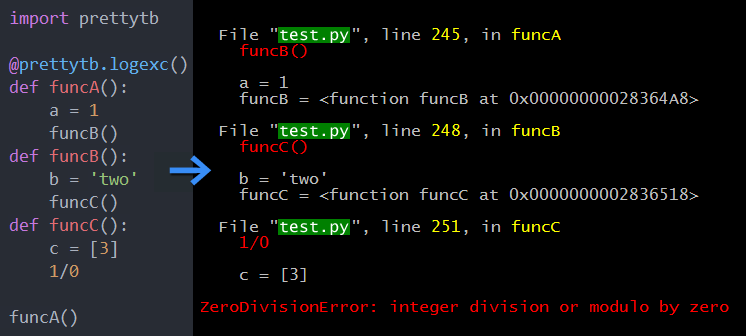

Prints stack tracebacks showing each frame's local variables and improves visual feedback using colors.

# Usage
Simply import `prettytb` and use `logexc` as a decorator for your functions/methods.

# Customizable
Check out the 'examples' directory for how to add e-mail feedback.

# Notes
- The colors are hard-coded and may not work very well on brighter backgrounds.
- Currently only tested on Windows with Python 2.7 and 3.4.

TBC
